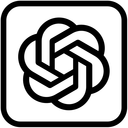

<div align="center">
    
  <h1 align="center">LevGPT</h1>
  <h4 align="center">Chatbot elaborado en C#, Windows Forms y Microsoft SQL Server</h4>
</div>

## ℹ️ Acerca de

* El proyecto LevGPT utiliza C# y Windows Forms para la creación de una interfaz por la que un usuario puede comunicarse con una API de Gemini, permitiendo conversaciones con un chatbot que imita (exageradamente) la personalidad del profesor Lev David Valenzuela López. La información del usuario se almacena en una base de datos Microsoft SQL Server.
* Desarrollado como proyecto final de la materia **Desarrollo de Sistemas III** impartida por el profesor Lev David Valenzuela López en el semestre 2025-2, en colaboración con Gonzalez Guerrero Gael, Laura Janeth Vásquez Ramos, Eduardo Sebastián Sánchez Peralta, Eduardo Sebastián Sánchez Peralta y Damián de Jesús Enríquez Solorzano.


## ⚙️ Dependencias
* Visual Studio
* .NET SDK 8.0
* Window Forms
* Microsoft SQL Server
* Gemini API

## 📋 Instrucciones de Uso

1. Instalar Visual Studio, .NET SDK 8.0 y Microsoft SQL Server.
2. Clonar el repositorio.
3. Crear la base de datos del sistema utilizando los comandos en **`docs/DS3_ProyectoFinal.sql`**.
4. Modificar el archivo **`LevGPT/Models/SQLCommands.cs`** para apuntar al servidor y base de datos correctas.
5. Verificar el modelo de Gemini que se utilizará en el archivo **`LevGPT/Models/Gemini.cs`**. Actualmente, se encuentra registrado el modelo **`gemini-3.8-flash`**.

> [!WARNING]
> El programa contaba con un modelo diferente en su entrega al profesor, pero este dejó de ofrecerse después de un tiempo, por lo que el modelo **`gemini-3.8-flash`** configurado actualmente podría haberse descontinuado y requerir una actualización en el archivo **`LevGPT/Models/Gemini.cs`**.

6. Obtener una clave de la API de Gemini y remplazarla en el archivo **`LevGPT/Models/Gemini.cs`**.
7. Compilar y ejecutar el programa utilizando Visual Studio.

## 🔍 Estructura del Proyecto

```text
TiendaDB
├── LevGPT: Proyecto de Windows Forms.
│   ├── Icon: Ícono del proyecto
│   ├── Models: Clases del sistema 
│   └── obj: Objetos generados por C#
├── docs: Documentación del proyecto y definición de la base de datos
└── LevGPT.slnx: Archivo de solución de Visual Studio
```

## 📷 Capturas de Pantalla


